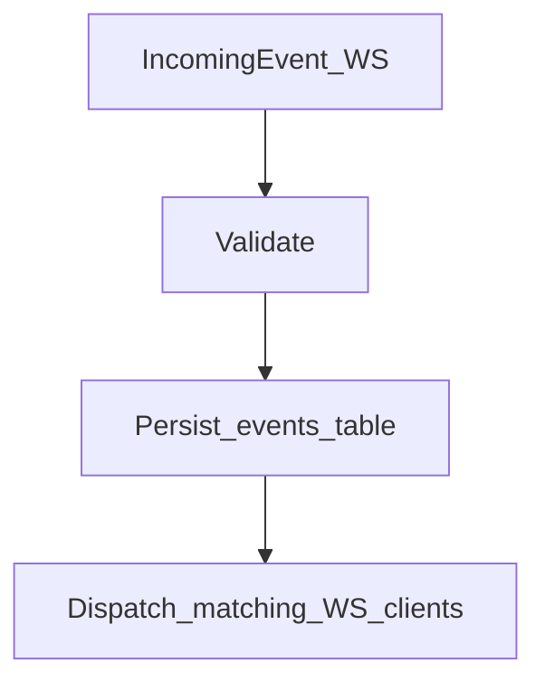

# Event System

The event system connects triggers, trading groups, and execution through an **event-driven model over WebSocket**.

Messages are categorized into two domains:
- **`event`**: Business events (signals, decisions). Persisted in the `events` table.
- **`system`**: Technical logs, discussion metadata, and state updates.

## Event Categories

The system defines several event sub-types:

1. **ImmediateEvent**
   - Processed immediately upon arrival at the gateway: validated, persisted, and dispatched via WebSocket.
   - This is the **primary flow** used by triggers and trading groups today.

2. **ScheduledEvent** (Future)
   - Contains a `trigger_at` timestamp in the future.
   - Used for deferred execution (e.g., FOMC meeting reminders).

3. **ConditionalEvent** (Future)
   - Contains a JSON `condition`.
   - Used for market watchers (e.g., "if BTC drops below $60k").

4. **PostTradeEvent** (`event_type: post_trade`)
   - The payload format used by trading groups to send a **Trade Decision** back to the backend.
   - Handled specially by the execution hooks if the condition domain is `trade_decision`.

---

## Database Schema Mapping

Business events are stored in the PostgreSQL `events` table with these key columns:
- `id`: UUID (generated by server).
- `type`: immediate | scheduled | conditional | post_trade.
- `source_id`: The ID of the component that generated the event.
- `priority`: 1–10.
- `targets`: Array of strings determining the routing destination (e.g., a specific trading group name).
- `title`, `payload`, `tags`.

:::info
When sending events from a client service, you do **not** send the `id` or `create_at` fields. The server generates these when persisting the event.
:::

---

## Routing Pipeline

1. **Validate**: The gateway checks the `type` discriminator (`event` or `system`) and validates the schema.
2. **Persist**: Business events are saved to the `events` table.
3. **Dispatch**: The gateway checks the `targets` array against the names of currently connected WebSocket clients and pushes the event to matching connections.
