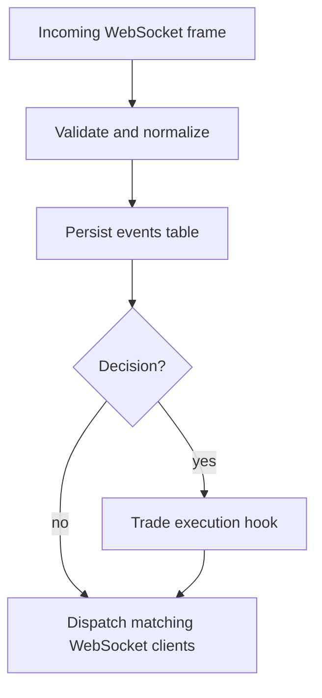

# Event System

The event system connects triggers, trading groups, and execution through structured WebSocket messages.

## Message Domains

| Frame | Description |
|---|---|
| `kind: "event"` | Business events: signals, decisions, config updates |
| `kind: "log"` | Operational logs and discussion metadata |
| `kind: "ack"` | Gateway acknowledgements |

Event frames use `category`:

| Category | Flow |
|---|---|
| `signal` | Trigger -> Gateway -> Trading Group |
| `decision` | Trading Group -> Gateway -> Trade Execution |
| `config_update` | Backend -> Trigger or Trading Group |

All event payloads are structured JSON objects. The system no longer uses JSON encoded as a string inside `payload`.

## Database Mapping

Business events are stored in PostgreSQL `events`:

- `id`: UUID generated by the server.
- `type`: internal compatibility value (`immediate`, `scheduled`, `conditional`, `post_trade`).
- `source_id`: authenticated source injected by the server.
- `priority`: 1 to 10.
- `targets`: routing targets.
- `title`, `payload`, `tags`.
- `condition`: compatibility metadata.
- `correlation_id`, `causation_id`: copied from top-level `trace`.

The database keeps historical column names for compatibility. The WebSocket wire format uses `kind`, `category`, `source`, `payload`, and `trace`.

## Routing Pipeline

1. **Validate and normalize**: The gateway rejects client-supplied `source`/`source_id`, parses v3 frames, and accepts legacy frames during migration.
2. **Persist**: Event payload objects are serialized to the text `events.payload` column.
3. **Execute**: `category: "decision"` events invoke trade execution.
4. **Dispatch**: The gateway sends v3 envelopes to subscribers whose channel matches `targets`.

