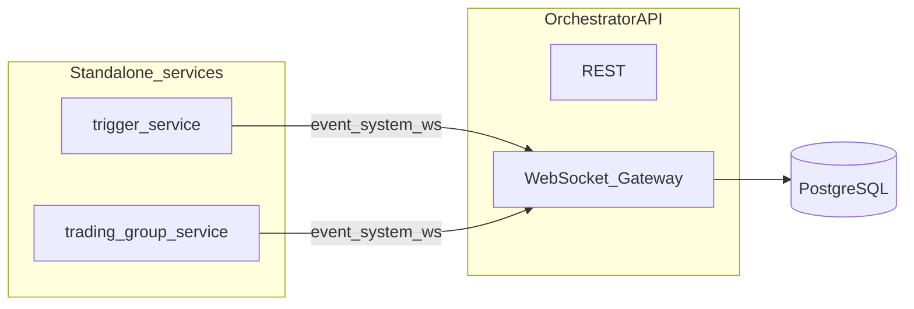

# Architecture Overview

AITradingSystem is organized as a set of independent **standalone services** connected to a **central backend orchestrator**. Communication between triggers, trading groups, and the backend relies entirely on **WebSocket + JSON**, without using complex message queues like Redis or RabbitMQ.

The platform is designed around **extreme modularity and custom integration**:
- **Pluggable Triggers**: Any external service that can speak WebSockets and send JSON payloads can function as a signal trigger.
- **Dual-Mode Trading Groups**: Supports both LLM-driven multi-agent discussion teams and direct programmatic algorithmic clients.
- **Custom Exchange Adapters**: The execution gateway uses the Adapter Pattern, allowing developers to add custom exchange bindings by subclassing the base adapter class and registering them with the exchange factory.

## Core Architecture Components

### Orchestrator API (Core Backend)
- **Framework**: FastAPI providing both REST endpoints and the **WebSocket gateway**.
- **Role**: Receives JSON messages from the UI and services, classifies them as `event` or `system`, persists events to PostgreSQL, and routes them to subscribed clients.
- **State**: Manages all configuration (trading groups, triggers, trade accounts, etc.).

### Event Handling
- There is no separate "Event Manager" microservice. The logic lives inside the backend gateway (validate, persist, dispatch).
- **ImmediateEvent** is the primary flow used for triggers and fast-path execution.

### Trigger Services
- Standalone processes that monitor external data sources.
- Examples include the `analyzer` (LangChain) or `analyzer2` (gpt4free) for news analysis.
- **Extensible**: You can easily build new triggers (RSI, Social Monitoring) that connect via WebSocket.

### Trading Group Services
- Standalone multi-agent processes.
- Receive events via WebSocket, run a multi-agent discussion, send the final decision back, and stream logs to the backend.

### Execution Service
- An internal backend module that places orders based on decisions received from trading groups.
- Connects to exchange APIs (Binance, OANDA) via adapters.
- Performs polling to synchronize order and position state.

---

## Service Communication

### REST
- Used by the UI dashboard for CRUD configuration, health checks, and metrics.

### WebSocket (Real-time Flow)
- Triggers and trading groups connect to `/ws/events` using their assigned tokens (`trigger_token` or `trading_group_token`).
- **Decoupled**: Each service runs as its own process, managing its own LLM configurations and state, relying on the central gateway only for routing messages.

### PostgreSQL
- The single source of truth for events, discussions, orders, and configuration.

---

## High-Level Architecture Diagram

